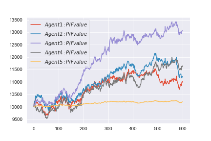
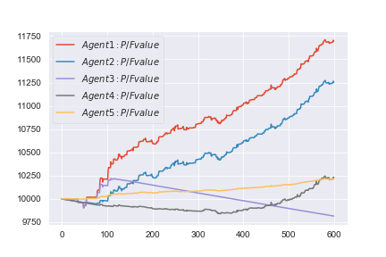
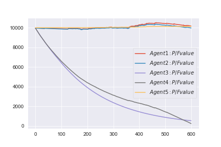

# Adversarial Reinforcement Learning for Portfolio Management
A final project for E6885 _Reinforcement Learning_, Fall 2018, Columbia University.

A full version of the final report in a form of paper can be found [here](./RL_Final_Report_v2.pdf)

# Abstract
In this paper, we created a *virtual stock exchange* where multiple agents invest in stocks against each other. Three of the agents implemented their own strategies based on different Reinforcement Learning (RL) algorithms. *No historical data was used* to train these RL agents. RL agents are given cash only and do not have any stocks at an initialization phase. Trading environments were designed in a way they accommodate realistic factors such as liquidity costs (buy expensive, sell cheap due to little orders that can be matched), transaction costs, and a management fee. We achieved this by introducing a sophisticated framework that admits the complex nature of the trading environment in the real world.

We present an approach of which algorithms the RL agents are based on, how we set our environment, and how a virtual stock exchange was constructed. We used Deep Neural Network(DNN) to represent the Actor-Critic network, which takes an input of stock prices and portfolio weights and outputs a vector of portfolio weights. RL agents’ actions are concretely implemented by placing orders and they do not know how their states would be until the orders are matched. We introduced non-RL agents, one of which, namely a mean-reversion agent, is in favor of our market environment in its strategy, and the other of which, namely a random agent, is to model the irrational behaviors of the real stock market. We end this paper with experimental analysis and future work.

## Experimental Results

### Policy Gradient(PG) agent with transaction cost of 0bp
Everyone looks happy.

### PG agent with transaction cost of 5bp
Two RL agents found out how to make handsome profits in the end.

### PG agent with transaction cost of 100bp
Two RL agents have managed to reserve their money in this extreme trading environment.

